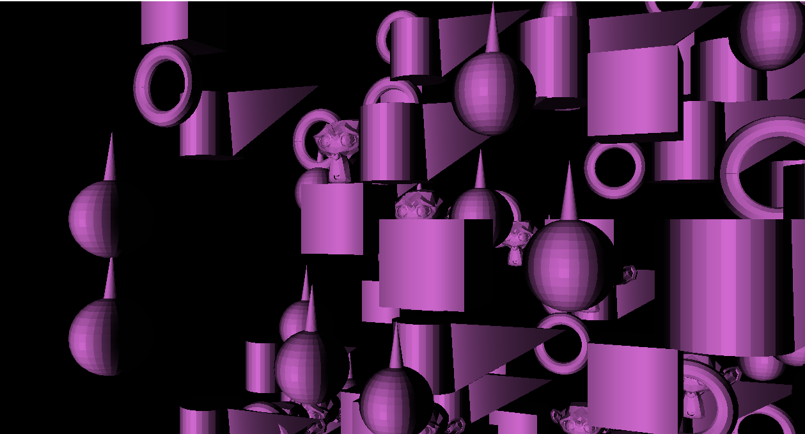
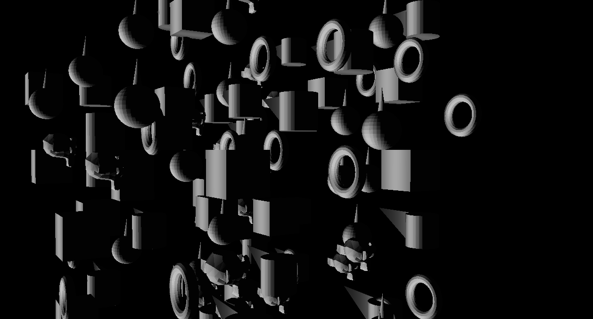

# WPF3DEngine
## This project is an attempt to create a 3D engine that can be used in WPF applications by using OpenGL.

### First milestone.
Create an environment with can be filled with .obj files from Blender and a basic directional light in the scene.

*As you can see in the pictures below, it is done.*

